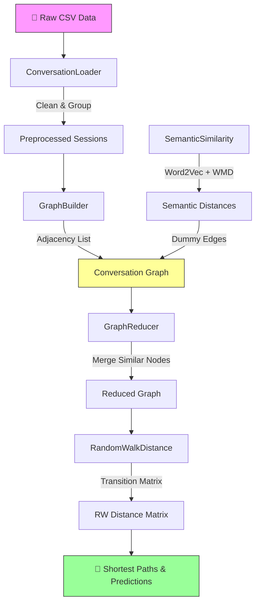

<div align="center">

# 🔬 Can NetGAN be Improved on Short Random Walks?

[](https://www.python.org/downloads/)
[](LICENSE)
[](https://arxiv.org/abs/1905.05298)

**A graph-based approach for optimizing chatbot conversations using semantic random walks**

*Improving NetGAN graph generation via dense-vertex-initialized short random walks,
applied to virtual assistant (AVI) conversation flow optimization.*

---

[Overview](#-overview) •
[Architecture](#-architecture) •
[Installation](#-installation) •
[Usage](#-usage) •
[Project Structure](#-project-structure) •
[Citation](#-citation)

</div>

---

## 📖 Overview

This repository implements the research methodology from the paper **"Can NetGAN be improved on short random walks?"** ([arXiv:1905.05298](https://arxiv.org/abs/1905.05298)).

### The Problem

Traditional NetGAN approaches use **random starting vertices** for generating graph walks, which leads to inconsistent and highly variable results — especially when walk lengths are short. This is critical in real-world applications like chatbot conversation optimization, where understanding conversation structure can:

1. **🎯 Reduce resolution time** — Find the shortest conversation path to solve a user's problem
2. **🔮 Predict follow-up questions** — Anticipate the user's next question based on the first interaction
3. **💡 Suggest relevant options** — Recommend related products/services based on semantic similarity

### The Solution

We propose starting random walks from a set of **dense vertices** — nodes whose importance is estimated based on the inverse of their influence over their neighborhood. The approach combines:

- **Graph Theory** — Modeling conversations as tree structures with Markov chain transitions
- **Semantic Similarity** — Word2Vec + Word Mover's Distance for computing semantic edges ("dummy edges")
- **Random Walk Distances** — Computing pairwise distances via weighted random walks for path optimization

### Key Results

> The proposed method achieves **significantly better accuracy**, **less variance**, and **fewer outliers** compared to random-start NetGAN on short walks.

---

## 🏗️ Architecture



### Pipeline Steps

| Step | Module | Description |
|------|--------|-------------|
| 1 | `data.loader` | Load & clean conversation CSV, group by session |
| 2 | `graph.builder` | Build conversation trees + intention edges |
| 3 | `similarity.semantic` | Train Word2Vec, compute WMD distances |
| 4 | `graph.builder` | Add dummy edges (semantic connections) |
| 5 | `graph.reducer` | Merge semantically equivalent nodes |
| 6 | `walks.random_walk` | Compute random walk distances |

---

## ⚙️ Installation

### Prerequisites

- Python 3.9 or higher
- pip or conda package manager

### Setup

```bash
# Clone the repository
git clone https://github.com/vfcarida/Can-NetGAN-be-improved-on-short-random-walks-.git
cd Can-NetGAN-be-improved-on-short-random-walks-

# Create a virtual environment (recommended)
python -m venv .venv
source .venv/bin/activate  # Linux/macOS
# .venv\Scripts\activate   # Windows

# Install the package in development mode
pip install -e ".[dev,notebooks]"
```

### Quick Install (dependencies only)

```bash
pip install -r requirements.txt
```

---

## 🚀 Usage

### As a Python Package

```python
from netgan_walks.data.loader import ConversationLoader
from netgan_walks.graph.builder import GraphBuilder
from netgan_walks.similarity.semantic import SemanticSimilarity
from netgan_walks.walks.random_walk import RandomWalkDistance

# 1. Load and preprocess conversations
loader = ConversationLoader("data/conversas.csv")
loader.load()
loader.clean()
sessions = loader.group_sessions()
intentions = loader.get_unique_intentions()

# 2. Build the conversation graph
builder = GraphBuilder(loader.data, intentions, max_conversations=10000)
graph = builder.build_adjacency_list()

# 3. Compute semantic distances and add dummy edges
sim = SemanticSimilarity(vector_size=100)
tokens = loader.tokenize_messages(loader.data["user_message"].tolist())
sim.train_word2vec(tokens)

# For small datasets, compute distances directly:
distances = sim.compute_wmd_distances(
    loader.data["user_message"].tolist()[:100]
)
GraphBuilder.add_dummy_edges(graph, distances)

# 4. Compute random walk distances
rwd = RandomWalkDistance(graph, max_walk_length=5, restart_prob=0.0002)
rwd.build_transition_matrix()
dist = rwd.compute_distance(node_i=0, node_j=42)
print(f"Random walk distance: {dist:.6f}")
```

### Using the Notebook

```bash
jupyter notebook notebooks/avi_graph_analysis.ipynb
```

---

## 📁 Project Structure

```
Can-NetGAN-be-improved-on-short-random-walks-/
│
├── README.md                           # This file
├── CONTRIBUTING.md                     # Contribution guidelines
├── LICENSE                             # MIT License
├── pyproject.toml                      # Project configuration (PEP 621)
├── requirements.txt                    # Pinned dependencies
├── .gitignore                          # Git ignore rules
│
├── docs/
│   └── paper/
│       └── 1905.05298.pdf              # Original research paper
│
├── notebooks/
│   └── avi_graph_analysis.ipynb        # Interactive analysis notebook
│
├── src/
│   └── netgan_walks/                   # Main Python package
│       ├── __init__.py                 # Package metadata
│       ├── data/
│       │   ├── __init__.py
│       │   └── loader.py              # CSV loading & preprocessing
│       ├── graph/
│       │   ├── __init__.py
│       │   ├── builder.py             # Graph construction & dummy edges
│       │   └── reducer.py             # Node merging & graph reduction
│       ├── similarity/
│       │   ├── __init__.py
│       │   └── semantic.py            # Word2Vec + WMD computation
│       └── walks/
│           ├── __init__.py
│           └── random_walk.py         # Random walk distance computation
│
├── tests/                              # Unit tests
│   ├── __init__.py
│   ├── test_loader.py
│   ├── test_builder.py
│   ├── test_reducer.py
│   └── test_semantic.py
│
└── assets/
    └── img/                            # Diagrams and figures
```

---

## 🧪 Running Tests

```bash
# Run all tests
pytest

# Run with coverage report
pytest --cov=netgan_walks --cov-report=term-missing

# Run a specific test module
pytest tests/test_builder.py -v
```

---

## 📚 Mathematical Foundation

### Dummy Edge Weights

Semantic connections between conversation nodes across different trees:

$$W_{i,j} = 1 - \frac{d_{i,j}}{D}$$

where $d_{i,j}$ is the Word Mover's Distance and $D$ is the maximum pairwise distance.

### Random Walk Distance

$$d_{rw}(v_i, v_j) = \sum_{\tau=1}^{L} P^{\tau}(i,j) \cdot c \cdot (1-c)^{\tau}$$

where $P^{\tau}$ is the $\tau$-th power of the transition matrix and $c$ is the restart probability.

### Transition Probability

$$P(i \to j) = \frac{W_{i,j}}{\sum_k W_{i,k}}$$

---

## 📝 Citation

If you use this work in your research, please cite:

```bibtex
@article{carida2019netgan,
  title     = {Can NetGAN be improved on short random walks?},
  author    = {Carid{\'a}, Vinicius Fernandes and others},
  journal   = {arXiv preprint arXiv:1905.05298},
  year      = {2019},
  url       = {https://arxiv.org/abs/1905.05298}
}
```

---

## 🤝 Contributing

Contributions are welcome! Please see [CONTRIBUTING.md](CONTRIBUTING.md) for guidelines.

---

## 📄 License

This project is licensed under the MIT License — see the [LICENSE](LICENSE) file for details.

---

<div align="center">

**Built with ❤️ for graph theory and conversational AI**

*Vinicius Fernandes Caridá • [arXiv:1905.05298](https://arxiv.org/abs/1905.05298)*

</div>
